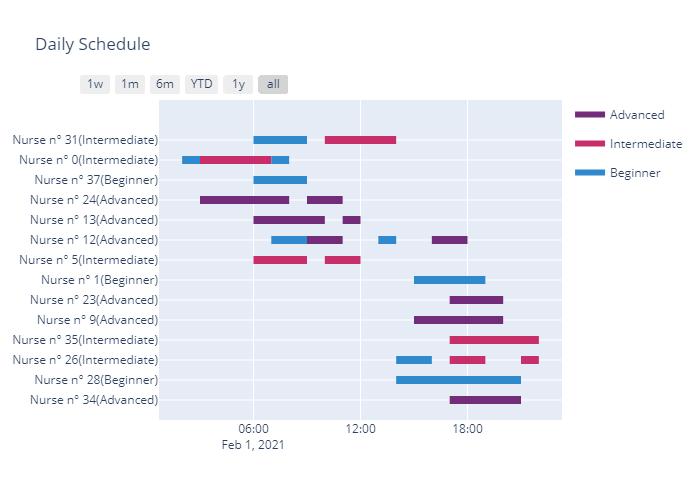

# <center> Nurse Scheduling Problem </center>


A large hospital has to cover a set of day-care activities with the available nurses.Each nurse can perform different subsets of the activities, which are implicitly definedby time and skill constraints.  In particular, for each activity the starting time andthe ending time are given, so it is known whether or not it is possible for the samenurse to perform both in sequence (it is assumed that it takes a short enough timeto move across the hospital so that this can be ignored).  Furthermore, nurses can beof three skill levels (beginner, intermediate, advanced), and each activity is markedwith the required skill level:  only nurses with the required skill, or one above, canperform it.  Union regulations dictate the maximum working time (sum of the timeshe’s performing activities) for each nurse; furthermore, nurses can’t be left waitingfor more that a given period (say, two hours) between subsequent activities.  Giventhe available number of nurses with each skill level, the problem is to assign a feasibleset of duties to the smallest possible number of nurses in order to have each activityperformed by exactly one of them.  Among solutions with the same number of nurses,these where less nurses perform activities requiring a skill level below their own arepreferred; the more the skill level is below, the more this should be avoided (but notat the cost of using more than the minimum number of nurses).


**Note:** You can download the repository containing this and other examples by clicking <a href="https://github.com/alberts96/A-nurse-scheduling-problem-solved-with-Gurobi/archive/master.zip" download>here </a> In order to run this Jupyter Notebook properly, you must have a Gurobi license. If you do not have one, you can request an [evaluation license](https://www.gurobi.com/downloads/request-an-evaluation-license/?utm_source=Github&utm_medium=website_JupyterME&utm_campaign=CommercialDataScience) as a *commercial user*, or download a [free license](https://www.gurobi.com/academia/academic-program-and-licenses/?utm_source=Github&utm_medium=website_JupyterME&utm_campaign=AcademicDataScience) as an *academic user*.


```python
# This command imports the Gurobi functions and classes.

import gurobipy as gp       #this is package provided by Gurobi to model problems
from gurobipy import GRB    #and interact with the solver
#Manage the data 
import pandas as pd
import numpy as np
#Graphic tools
import matplotlib
import matplotlib.pyplot as plt
```


## Mathematical Model
The model is an oriented graph representation in which each activity is a node of the graph, connected each other if them can be performed consecutively.
Every link has capacity 1 and the nurses are represented by the flow that moves in this network, they start from the source and come back to the source.
Is a <b>3-index model</b> similar to the one typically used for the <b>vehicle routing problem</b>. 


```python
#INITIALIZATION OF THE MODEL
# The Model() constructor creates a model object m. The name of the model object m is Nurses Scheduling
m = None
m = gp.Model('Nurses Scheduling')

#READING DAT FROM CSV FILES
activities = pd.read_csv("activities.csv")
nurses = pd.read_csv("nurses.csv")
```

    Using license file C:\Users\carlo\gurobi.lic
    Academic license - for non-commercial use only
    

## Data definition

Input data are defined over the following sets:
* <b>K</b> is the set of the nurses, two values are assigned to each nurse: level and maximum work time;
* <b>A</b>is the set of the activities, each activity has three values: level, start time, end time;  
* <b>I</b> is the super-set of <b>A</b>  united with the auxiliary activities 0 that has the function of source;
* <b>W</b> is the maximum waiting time between two activities done by the same nurse.


```python
#SETS
I = range(len(activities) + 1) #index for all the tasks more the source
K = range(len(nurses)) #index for all the nurse
A = I[1:]       #index for all tasks (source and thin are exclused)

#PARAMETERS
q = list(nurses['maxh'].copy())
l = list(nurses['level'].copy())
s = list(activities['start_time'].copy())
t = list(activities['end_time'].copy())
h = list(activities['hard'].copy())
```

### Source
For use the graph in a better and easiest way, a source and a thi are added at the sety of athe activities,rispectively as the first and the last one.

Three main sets are defined:<ul> 
    <li><b>'K'</b> for the  <b>nurses</b></li>
    <li><b>'A' </b>and <b>'I'</b> for the <b>activities</b></li>
    </ul>
    
<b>N.B.</b>While 'A' contains all and only the activities 'I' contains also the source :<ul>
    <li><b>I[0]</b> :   recall the <b>source</b></li>
    <li><b>I[1:]</b>: recall all tasks</li>
        </ul>


```python
#SOURCE
s.insert(0,0)
t.insert(0,0)
h.insert(0,0)
```


### Support Sets

#### Backward star \& forward star
For each activity we defined his Backward Star and Forward Star, constraining the duration of the waiting time between two activity to be less than W.


```python
#defining the  backward star 
back=[]
back.append([])  #source has an empty set as backward star
for i in I[1:-1]:
    backi=[0]
    for j in I[1:-1]:
        if (s[i]>=t[j] and s[i]-t[j]<=2):
            backi.append(j)
    back.append(backi)
back.append([i for i in I[1:-1]]) #instead, tink has all other nodes except
                                  # the source and itself
#defining the forward star

forward=[]
forward.append([i for i in I[1:-1]])  #all tasks for the source
for i in I[1:-1]:
    forwardi=[I[-1]]
    for j in I[1:-1]:
        if (s[j]>=t[i] and s[j]-t[i]<=2):
            forwardi.append(j)
    forward.append(forwardi)
forward.append([])  #empty forward for the thin

```


#### Level compatible
We defined support sets for activities and nurses. For each nurse a subset of activities that can be assigned to the nurse and vice-versa.


```python
#SUBSETS OF NURSES
levelok = []
levelok.append([k for k in K])
for i in A:
    levelokk = []
    for k in K:
        if l[k] >= h[i] : levelokk.append(k)
    levelok.append(levelokk)
levelok.append([k for k in K])
KL = levelok.copy()

#SUBSETS OF ACTIVITIES
levelok = []
for k in K:
    levelokk = [0]
    for i in A:
        if l[k] >= h[i] : levelokk.append(i)
    levelokk.append(I[-1])
    levelok.append(levelokk)
AL = levelok.copy()
```

### Decision Variables
We defined the binary variable:
$x_{ij}^{k}$ that represent the transition of a nurse from a terminated activity to the next one (both assigned to a same nurse).


```python
#Only the necessary variables are instanciated
variables = []
for i in I:
    for j in I:
        if (s[j] >= t[i] and s[j] <= t[i]+2) or (i== 0 and j!= 0 )or ( i!=0 and j == 0) : # j in forward of i
            for k in K:
                if h[i] <= l[k] and h[j] <= l[k] and q[k]>= t[i] - s[i] + t[j] - s[j]: # k is able to do both i and j
                    variables.append((i,j,k))
                        
X = m.addVars(variables, vtype=GRB.BINARY, name="x")    #route variables


df = pd.DataFrame(variables, columns = ['I', 'J', 'K'])
```

###  Objectives
* The main objective minimize the number of nurses working during the day by minimizing the sum of nurses leaving the node 0 (`Source').
* The secondary minimize the total difference between the level of the nurse and the tasks in which are involved.

Since the objectives <b> hierarchical</b>, we can solve the primary, set it as a constraint and then solve the second. Having a solution for the first problem, allow the solver to concentrate more in is solving the secondary one that is the hardest one.
However Gurobi offers a hierachical objective instantiation.


```python
#OBJECTIVE
# The setObjectiveN() method of the model object m allows to define multiple objectives.
# The first argument is the linear expression defining the most important objective, called primary objective, in this case 
# it is the minimization of extra workers required to satisfy shift requirements. The second argument is the index of the 
# objective function, we set the index of the primary objective to be equal to 0. The third argument is the priority of the 
# objective. The fourth argument is the relative tolerance to degrade this objective when a lower priority
# objective is optimized. The fifth argument is the name of this objective.
# A hierarchical or lexicographic approach assigns a priority to each objective, and optimizes for the objectives in 
# decreasing priority order. For this problem, we have two objectives, and this objective has the highest priority which is
# equal to 2. When the secondary objective is minimized, since the relative tolerance is 0.2, we can only degrade the 
# minimum number of extra workers up to 20%. BUT IN OUR CASE MUST BE 0

#main
m.setObjectiveN(gp.quicksum(X[(i,j,k)]for (i,j,k) in df[df.I == 0].values),
                index = 0,priority=2,name= 'number of working nurses')

#secondary
m.setObjectiveN( gp.quicksum(X[(i,j,k)]*(l[k]-h[i]) for (i,j,k) in df[df.I != 0].values),
                index = 1, priority=1,name="skill not used")

m.ModelSense = gp.GRB.MINIMIZE
```

### Constraints
We defined 4 constraints:
1. Each nurse doesn't exceed his maximum time of work;   
2. Each activity is carried out by exactly one nurse;
2. Each working nurse can exit from the source node exactly one time;
4. If a nurse is not assigned to any activity it remains in the source, instead if the nurse is assigned to some activities, this constraint assures us that the nurse will exits from the source and will return to the source.


```python
#COSTRAINTS
#1 sum of time requests to work at the task to which a nurse is assigned can't be more than 
#   the max quantity of time 
for k in K :
    m.addConstr(gp.quicksum(X[(i,j,k)]*(t[i]-s[i]) for (i,j,k) in df[(df.K == k)&(df.I!=0)].values) <= q[k] , name='maxhours')  

#2) each activity must be assigned to exactly one nurse
for i in A:
    m.addConstr(gp.quicksum(X[(i,j,k)] for (i,j,k) in df[df.I==i].values) == 1 , name='Assignment')
    m.addConstr(gp.quicksum(X[(j,i,k)] for (j,i,k) in df[df.J==i].values) == 1 , name='Assignment')

#3) each activity, for each nurse, must have the same number of incoming arc and outgoing arcs
#   and those must exists only if the task is assigned to that nurse
for i in A:
    for k in set(df[df.I==i].K.values):
        m.addConstr(gp.quicksum(X[(i,j,k)] for (i,j,k) in df[(df.I==i)&(df.K==k)].values) == 
                    gp.quicksum(X[(j,i,k)] for (j,i,k) in df[(df.J==i)&(df.K==k)].values))

#4) each nurse that go out from the source (start to work), must end his day at the thin
for k in K :
    m.addConstr(gp.quicksum(X[(i,j,k)] for (i,j,k) in df[(df.I==0)&(df.K==k)].values) == gp.quicksum(X[(i,j,k)] for (i,j,k) in df[(df.J==0)&(df.K==k)].values))
    m.addConstr(gp.quicksum(X[(i,j,k)] for (i,j,k) in df[(df.I==0)&(df.K==k)].values)<=1)
```

## Solving 


```python
m.params.TimeLimit = 300 #setting a time limit of 300 seconds
m.optimize()
```

    Changed value of parameter TimeLimit to 300.0
       Prev: inf  Min: 0.0  Max: inf  Default: inf
    Gurobi Optimizer version 9.0.1 build v9.0.1rc0 (win64)
    Optimize a model with 769 rows, 2017 columns and 8747 nonzeros
    Model fingerprint: 0xae5d746b
    Variable types: 0 continuous, 2017 integer (2017 binary)
    Coefficient statistics:
      Matrix range     [1e+00, 4e+00]
      Objective range  [1e+00, 2e+00]
      Bounds range     [1e+00, 1e+00]
      RHS range        [1e+00, 7e+00]
    
    ---------------------------------------------------------------------------
    Multi-objectives: starting optimization with 2 objectives ... 
    ---------------------------------------------------------------------------
    
    Multi-objectives: applying initial presolve ...
    ---------------------------------------------------------------------------
    
    Presolve removed 213 rows and 203 columns
    Presolve time: 0.09s
    Presolved: 556 rows and 1814 columns
    ---------------------------------------------------------------------------
    
    Multi-objectives: optimize objective 1 (number of working ) ...
    ---------------------------------------------------------------------------
    
    Presolve removed 87 rows and 109 columns
    Presolve time: 0.14s
    Presolved: 469 rows, 1705 columns, 7589 nonzeros
    Variable types: 0 continuous, 1705 integer (1705 binary)
    
    Root relaxation: objective 1.122222e+01, 695 iterations, 0.10 seconds
    
        Nodes    |    Current Node    |     Objective Bounds      |     Work
     Expl Unexpl |  Obj  Depth IntInf | Incumbent    BestBd   Gap | It/Node Time
    
         0     0   11.22222    0   94          -   11.22222      -     -    0s
    H    0     0                      23.0000000   11.22222  51.2%     -    0s
    H    0     0                      22.0000000   11.22222  49.0%     -    0s
    H    0     0                      21.0000000   11.22222  46.6%     -    0s
    H    0     0                      19.0000000   11.22222  40.9%     -    1s
         0     0   11.84638    0  154   19.00000   11.84638  37.7%     -    1s
    H    0     0                      17.0000000   11.84638  30.3%     -    1s
         0     0   12.22772    0  153   17.00000   12.22772  28.1%     -    1s
         0     0   12.61755    0  164   17.00000   12.61755  25.8%     -    1s
         0     0   12.61755    0  160   17.00000   12.61755  25.8%     -    1s
         0     0   12.93296    0  150   17.00000   12.93296  23.9%     -    1s
    H    0     0                      16.0000000   12.93296  19.2%     -    1s
         0     0   12.93296    0  145   16.00000   12.93296  19.2%     -    1s
         0     0   12.96858    0  176   16.00000   12.96858  18.9%     -    1s
         0     0   12.96858    0  172   16.00000   12.96858  18.9%     -    1s
         0     0   12.97633    0  188   16.00000   12.97633  18.9%     -    2s
         0     0   12.97633    0  149   16.00000   12.97633  18.9%     -    2s
    H    0     0                      15.0000000   12.97718  13.5%     -    2s
         0     2   12.97718    0  148   15.00000   12.97718  13.5%     -    2s
       832   552   13.67063   20   86   15.00000   13.10278  12.6%  27.6    5s
      1109   715   13.62500   38  155   15.00000   13.14659  12.4%  25.5   10s
      1126   727   13.47561   10  196   15.00000   13.33031  11.1%  25.1   15s
      1142   740   13.43859   15  195   15.00000   13.37708  10.8%  35.7   20s
      1275   745   13.92919   23  170   15.00000   13.45944  10.3%  50.7   25s
    * 1373   712              33      14.0000000   13.49880  3.58%  56.2   26s
    
    Cutting planes:
      Gomory: 32
      Cover: 5
      Implied bound: 19
      Clique: 57
      MIR: 52
      StrongCG: 5
      Flow cover: 39
      Inf proof: 1
      Zero half: 52
      RLT: 10
    
    Explored 1387 nodes (81413 simplex iterations) in 26.72 seconds
    Thread count was 4 (of 4 available processors)
    
    Solution count 8: 14 15 16 ... 23
    
    Optimal solution found (tolerance 1.00e-04)
    Best objective 1.400000000000e+01, best bound 1.400000000000e+01, gap 0.0000%
    ---------------------------------------------------------------------------
    
    Multi-objectives: optimize objective 2 (skill not used) ...
    ---------------------------------------------------------------------------
    
    
    Loaded user MIP start with objective 10
    
    Presolve removed 73 rows and 97 columns
    Presolve time: 0.17s
    Presolved: 484 rows, 1717 columns, 8110 nonzeros
    Variable types: 0 continuous, 1717 integer (1717 binary)
    
    Root simplex log...
    
    Iteration    Objective       Primal Inf.    Dual Inf.      Time
           0    0.0000000e+00   6.200000e+01   0.000000e+00     27s
         524    5.0000000e+00   0.000000e+00   0.000000e+00     27s
    
    Root relaxation: objective 5.000000e+00, 524 iterations, 0.05 seconds
    
        Nodes    |    Current Node    |     Objective Bounds      |     Work
     Expl Unexpl |  Obj  Depth IntInf | Incumbent    BestBd   Gap | It/Node Time
    
         0     0    5.00000    0   30   10.00000    5.00000  50.0%     -   27s
    H    0     0                       9.0000000    5.00000  44.4%     -   27s
    H    0     0                       8.0000000    5.00000  37.5%     -   27s
         0     0    5.00000    0   73    8.00000    5.00000  37.5%     -   27s
         0     0    5.42500    0   70    8.00000    5.42500  32.2%     -   27s
         0     0    5.62500    0   64    8.00000    5.62500  29.7%     -   27s
         0     0    5.62500    0   24    8.00000    5.62500  29.7%     -   28s
         0     0    5.62500    0  103    8.00000    5.62500  29.7%     -   28s
         0     0    5.62500    0   95    8.00000    5.62500  29.7%     -   28s
         0     0    5.64410    0  103    8.00000    5.64410  29.4%     -   28s
         0     0    5.64410    0  108    8.00000    5.64410  29.4%     -   28s
         0     0    5.69565    0   99    8.00000    5.69565  28.8%     -   28s
         0     0    5.69565    0  114    8.00000    5.69565  28.8%     -   28s
         0     0    5.69565    0  118    8.00000    5.69565  28.8%     -   28s
         0     0    5.69565    0   82    8.00000    5.69565  28.8%     -   28s
         0     2    5.71429    0   82    8.00000    5.71429  28.6%     -   28s
       645   170     cutoff   35         8.00000    6.38458  20.2%  28.1   30s
    
    Cutting planes:
      Gomory: 5
      Cover: 19
      Implied bound: 15
      Clique: 18
      MIR: 9
      StrongCG: 1
      Inf proof: 7
      Zero half: 15
      RLT: 3
    
    Explored 1193 nodes (36402 simplex iterations) in 30.68 seconds
    Thread count was 4 (of 4 available processors)
    
    Solution count 3: 8 9 10 
    
    Optimal solution found (tolerance 1.00e-04)
    Best objective 8.000000000000e+00, best bound 8.000000000000e+00, gap 0.0000%
    
    ---------------------------------------------------------------------------
    Multi-objectives: solved in 30.72 seconds, solution count 10
    
    

## Visualize the solution 




```python

```
